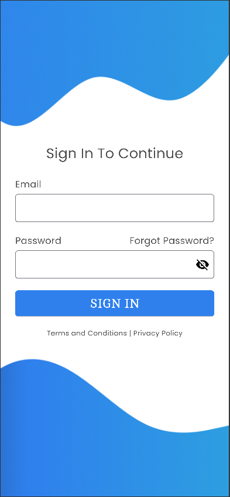

# Simple Login UI – Flutter

A clean and minimal **Flutter Login UI** screen built with modern design principles using custom fonts and validation.

## Features

- Beautiful Login Screen UI
- Email & Password Input Fields
- Email Format Validation with RegExp
- Password Empty Check Validation
- Password Visibility Toggle
- Navigation to Home Screen on Success
- Light Theme with Custom Colors and Google Fonts
- Circular Progress Indicator on Button

### Login Screen

1. **Clone the repo**
git clone https://github.com/your-username/simple-login-ui.git

2. **Install dependencies**
   
flutter pub get

4. **Run the app**
   
flutter run
