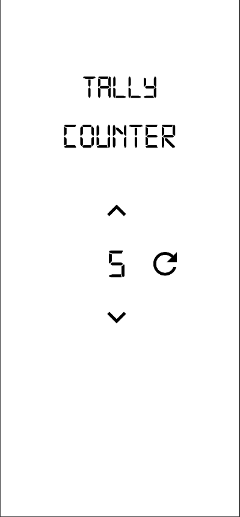

# 🧮 Tally Counter App (Week 2)

A simple Flutter counter app that demonstrates:

- State management using `setState()`
- Persistent data storage using `SharedPreferences`
- Custom font (`DigitalNumbers`)
- Responsive design using `flutter_screenutil`

---

## Features

- Increase and decrease the counter with arrow buttons
- Reset counter with one tap
- Saves counter value even after app restart
- Digital-style font for a retro look

---

## How to Run

1. Clone the repository
2. Run `flutter pub get`
3. Add the custom `DigitalNumbers` font to your `pubspec.yaml`
4. Run the app using `flutter run`

---

## Preview

---

## Author

Muhammad Saad Jamal
