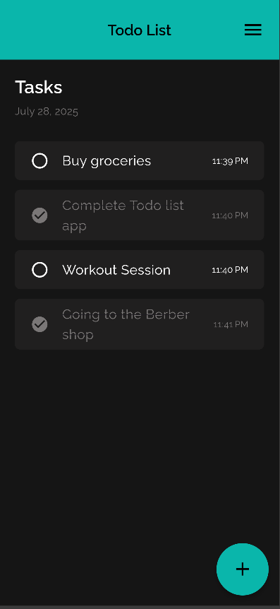

# Flutter Todo List App

A simple and clean Todo List app built with Flutter. Add, complete, and save tasks using local storage (`SharedPreferences`). Designed with Google Fonts and responsive layout via `flutter_screenutil`.

## Features
- Add tasks with time
- Mark tasks as completed
- Tasks saved locally
- Responsive UI
- Custom fonts and colors

## Dependencies
- shared_preferences  
- flutter_screenutil  
- google_fonts  
- intl


## Preview


## Getting Started
```bash
flutter pub get
flutter run
