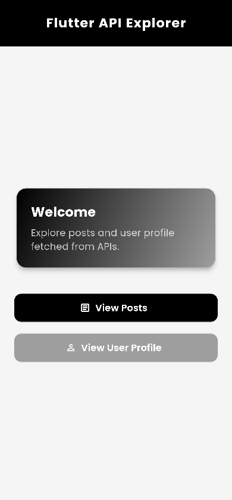
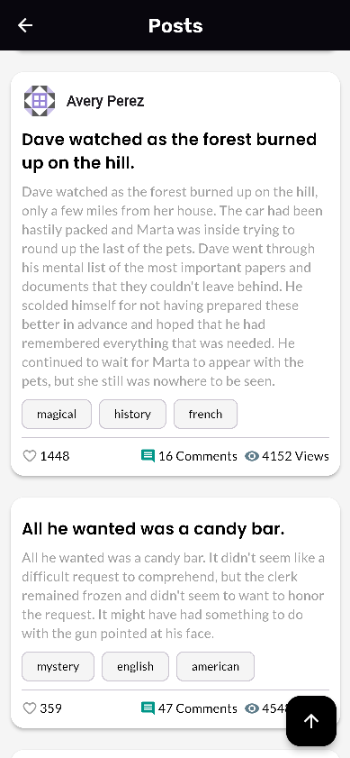
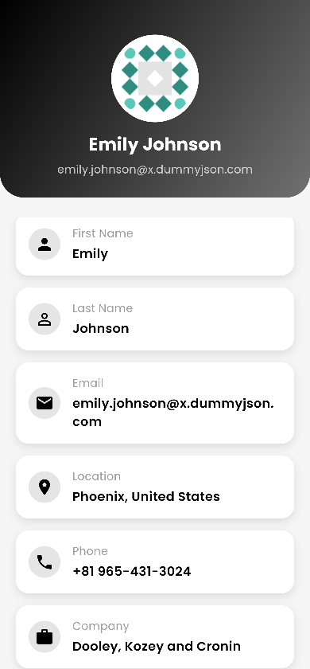

# Flutter API Explorer

A Flutter application built for **Internship Cycle 2 (Week 4)** – focused on **API Integration & Networking**.

## 🚀 Features
- Fetch & parse JSON from REST API (DummyJSON Users & Posts)
- Home navigation to Posts & User Profile
- Posts Page:
  - Display posts with user info (name, picture)
  - Infinite scroll with **Load More** functionality for better performance
  - Like button with state management per post
  - Smooth scrolling with "Scroll to Top" floating action button
- User Profile Page:
  - Display name, email, company, and profile picture
- Error handling & loading indicators

## 🛠️ Tech Stack
- **Flutter**
- **Dart**
- **http package**
- **DummyJSON API**

## 📲 How to Run
1. Clone the repo:
   ```bash
   git clone https://github.com/yourusername/flutter_api_explorer.git

## Screenshots



