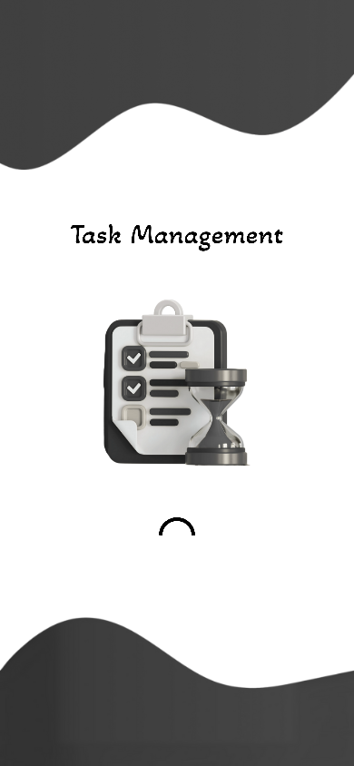
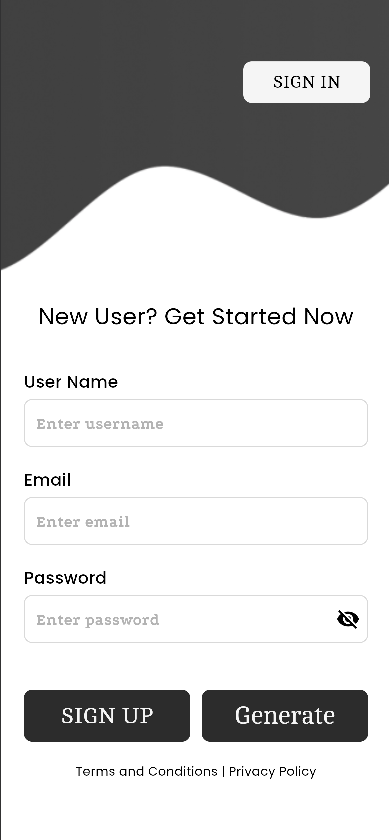
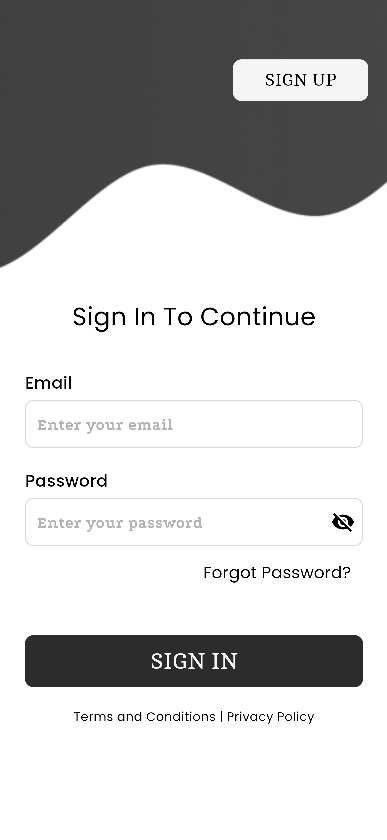
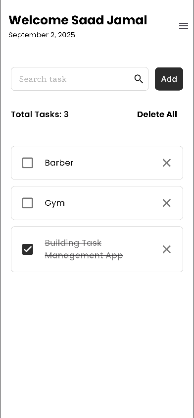
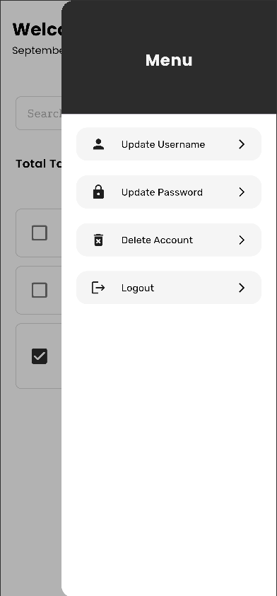

# Task Management App  

A simple and clean **Task Management App** with **Firebase + Firestore + Provider integration**.  
Manage your daily tasks with real-time updates, seamless state management and secure account management.   

---

## Features  
- **User Authentication** (Firebase Email/Password)  
- **Task Management**  
  - Add, Edit, Delete & Search Tasks  
  - Mark as Complete or Incomplete  
  - Tasks update in **real time** with Provider  
- **Account Management**  
  - Update Username  
  - Update Password  
  - Forgot Password (via email)  
  - Delete Account  
- **Cloud Sync**  
  - Tasks saved per user in Firestore (using UID)  
  - Automatically syncs across devices  
- **State Management with Provider**  
  - Centralized task handling (add, update, delete)  
  - UI automatically rebuilds on state changes  
- **Responsive UI**  
  - Built with `flutter_screenutil` for adaptability  
  - Custom fonts with Google Fonts  
- **UI/UX Enhancements**  
  - Smooth animations for dialogs & transitions  
  - Themed colors and reusable widgets  
- **Optimized Performance**  
  - Avoids unnecessary rebuilds  
  - Uses `Consumer` and `Selector` for efficiency  

---

## Tech Stack  
- **Framework:** Flutter  
- **State Management:** Provider  
- **Backend:** Firebase Authentication, Cloud Firestore  
- **UI:** Flutter ScreenUtil, Google Fonts  

---

## App Preview  

