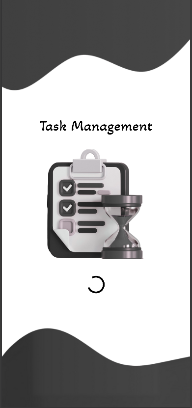
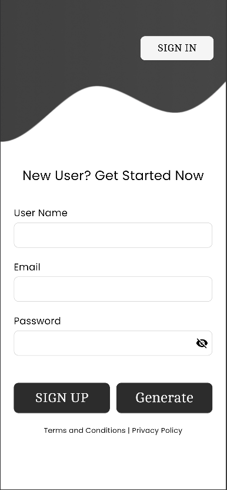
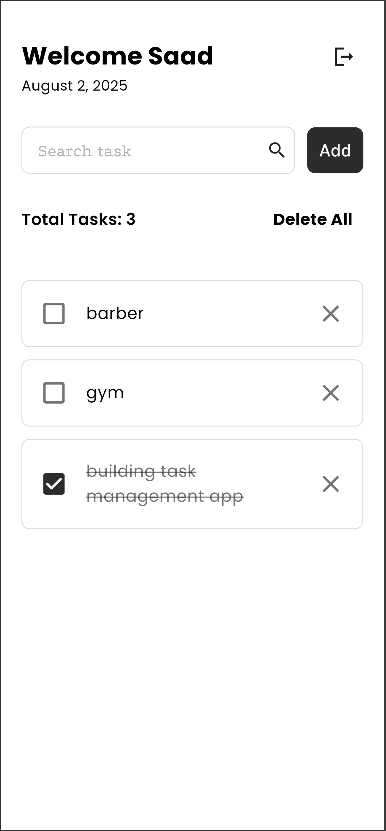

# Task Management App

A simple and clean Flutter app to manage your daily tasks with Firebase integration.

## Features
- User Authentication (Firebase)
- Add, Edit, Delete & Search Tasks
- Mark tasks as Complete or Incomplete
- Tasks saved per user (sync across devices)
- Responsive UI (uses `flutter_screenutil`)
- Custom fonts and themed UI

## Tech Stack
- Flutter
- Firebase Auth & Firestore
- Google Fonts

## Preview

